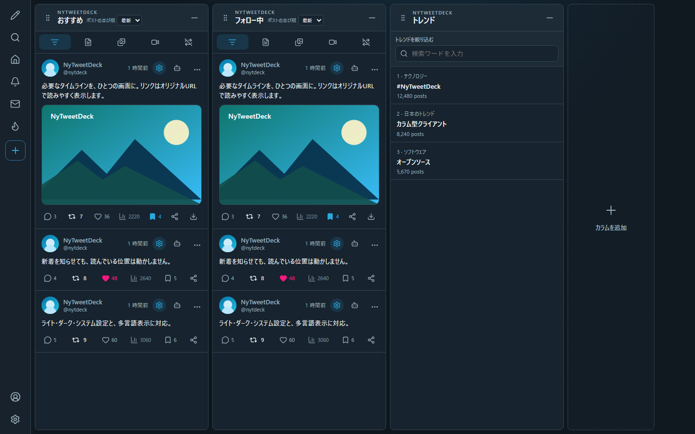
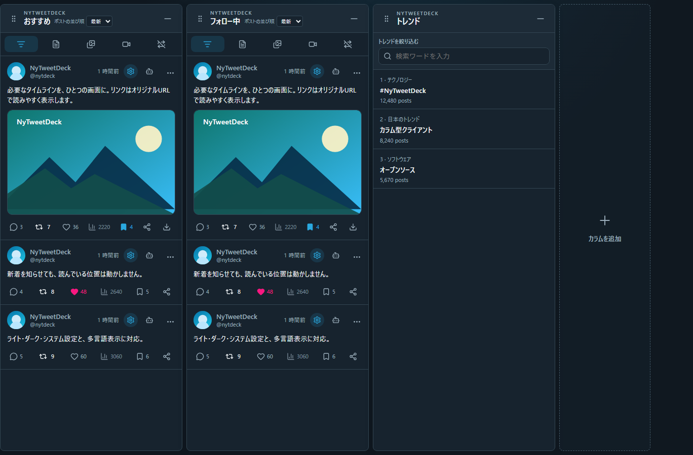
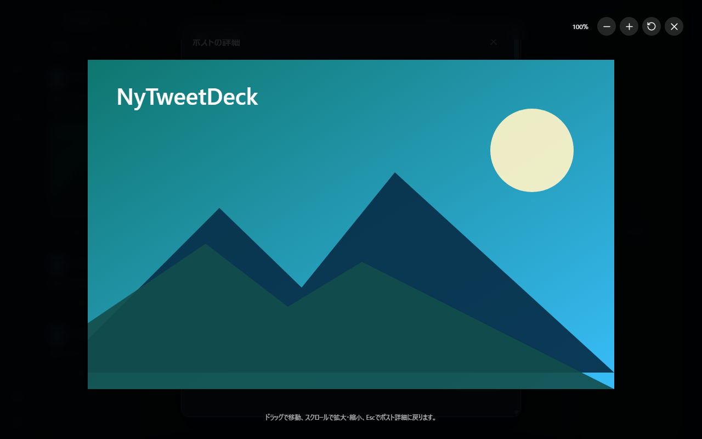
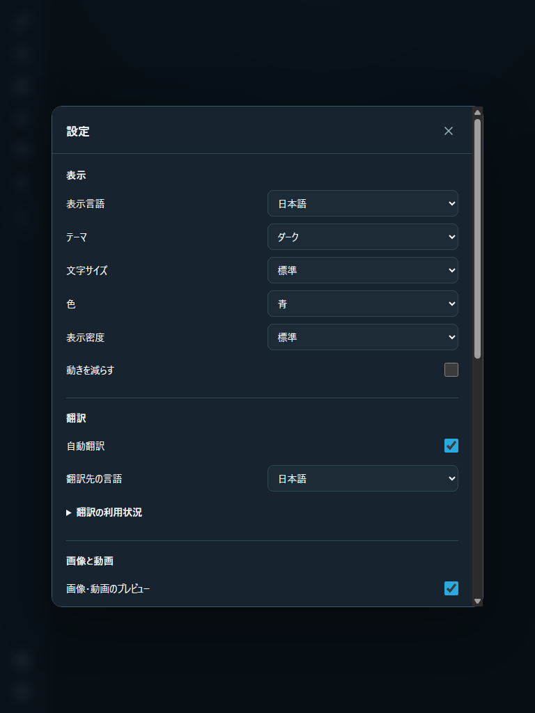

# NyTweetDeck

NyTweetDeckは、ブラウザで使うローカル動作のカラム型Xクライアントです。複数のタイムライン、検索、通知、リストなどを横に並べ、ひとつの画面で確認できます。



## 画面イメージ

| 複数カラム | 画像ビューア |
| --- | --- |
|  |  |

メニューやカラムは追加・並べ替えでき、各カラムの「トップ／最新」順、設定画面からテーマ、表示言語、翻訳先言語、自動翻訳、動画再生などを変更できます。



## まず使う

### 1. 必要なものを用意する

配布ZIPを使う場合に必要なのは次の2つです。

- Java 17、21、25のいずれか
- Google Chrome（Xへのログイン時だけ使用）

ZIPを展開してください。統合インストーラーがJARとランチャーをOSのユーザー別アプリ領域へ配置するため、インストール後は展開フォルダーを移動しても自動起動へ影響しません。

### 2. NyTweetDeckをインストールして起動する

Windowsでは専用ルートCAの信頼確認とhosts更新の管理者確認を承認し、次を実行します。

```powershell
.\install-nytweetdeck.ps1
```

macOSまたはLinuxでは、展開したフォルダーで次を実行します。hosts、証明書ストア、443番ポートの設定に`sudo`を使用します。

```sh
./install-nytweetdeck.sh
```

統合インストーラーは、本体を安定したアプリ領域へ配置し、専用CAとhosts、自動起動を設定して既存プロセスを更新後のJARで再起動します。`https://ny.tweetdeck.com`と<http://127.0.0.1:18080>がともに応答することを確認できた場合だけ成功します。

自動起動やローカルHTTPSを使わず一時的に起動する場合だけ、Windowsでは`run-nytweetdeck.cmd`、macOSまたはLinuxでは`./run-nytweetdeck.sh`を使用します。

### 端末内だけで`https://ny.tweetdeck.com`を使う

このアドレスは公開サイトではありません。導入スクリプトが実行端末のhostsで`ny.tweetdeck.com`を`127.0.0.1`へ固定し、端末内でNyTweetDeck専用ルートCAと、そのCAが署名したサーバー証明書を生成します。専用ルートCAだけをOSの信頼ストアへ登録するため、対応ブラウザでは証明書警告なしで利用できます。NyTweetDeckもloopbackだけで待ち受けるため、LANやインターネットからは接続できません。既存の<http://127.0.0.1:18080>も継続して使えます。

通常は統合インストーラーがここまで自動で行います。ローカルHTTPS設定だけを再生成する場合は、Windowsで次を実行します。登録済みの自動起動タスクがあれば再起動してHTTPS応答まで確認します。

```powershell
.\install-local-domain.ps1
```

以前の自己署名サーバー証明書を導入済みの場合も、同じコマンドを再実行すると専用CA形式へ置き換わります。Windowsでは証明書を現在のブラウザ利用者へ登録し、管理者権限はhosts更新だけに使用します。

macOSまたはLinuxでローカルHTTPS設定だけを再生成する場合は次を実行します。

```sh
./install-local-domain.sh
```

LinuxではJavaへ443番ポートだけを開くcapabilityを設定し、macOSではloopbackの443番をNyTweetDeckの18443番へ転送します。解除する場合は同梱の`uninstall-local-domain.ps1`または`uninstall-local-domain.sh`を使用します。

Firefox 120以降はWindowsとmacOSでOSへ追加したルートCAを既定で利用します。Firefox設定で「インストールしたサードパーティーのルート証明書を自動的に信頼する」を無効にしている場合は、この設定を有効にしてFirefoxを再起動してください。LinuxではディストリビューションがFirefoxへシステムCAを連携していない場合、Firefox側にも専用CAの登録が必要です。

### ログオン時に自動起動する

通常は統合インストーラーが登録します。Windowsで自動起動だけを再登録する場合は次を実行します。現在実行中の旧JARを安全に停止し、登録したJARで再起動して準備完了まで確認します。

```powershell
.\install-autostart.ps1 -StartNow
```

macOSではLaunchAgent、Linuxではsystemd user serviceへ登録します。

```sh
./install-autostart.sh --start
```

NyTweetDeck本体、自動起動、ローカルHTTPS設定をまとめて解除する場合は、Windowsで`.\uninstall-nytweetdeck.ps1`、macOSまたはLinuxで`./uninstall-nytweetdeck.sh`を使用します。展開フォルダーを削除済みでも、Windowsは`%LOCALAPPDATA%\NyTweetDeck\app\uninstall-nytweetdeck.ps1`、macOS/Linuxはユーザー別データ領域の`NyTweetDeck/app/uninstall-nytweetdeck.sh`から解除できます。自動起動だけを解除する場合は`uninstall-autostart.ps1`または`uninstall-autostart.sh`を使用します。自動起動ではブラウザを勝手に開かず、アクセス時までバックグラウンドで待機します。

### 3. Xアカウントへログインする

1. メインメニューのアカウント切り替えアイコンを押します。
2. 「Xアカウントにログイン」を押します。
3. 自動的に開く専用Chromeで、X公式画面へのログインを完了します。
4. Xのホーム画面が表示されたら、専用Chromeを閉じずにNyTweetDeckへ戻ります。
5. 「Xへのログインが完了しました」を押します。

パスワード、2要素認証、Passkey、CaptchaはXの画面へ直接入力します。NyTweetDeckの画面へXのパスワードを入力することはありません。

別のアカウントを追加する場合も同じ手順を繰り返します。利用するアカウントは、アカウント切り替え画面からいつでも変更できます。次回起動時は前回選択した保存済みアカウントを自動で利用し、そのアカウントがない場合は保存一覧の#1を利用して、保存済みカラムの読み込みと表示を開始します。

> [!WARNING]
> 取得したX Webセッションは、OSのユーザー別アプリケーションデータ領域へ暗号化せずに保存されます。このファイルを読み取れる人はログイン状態を悪用できる可能性があります。共有PCや信頼できない端末では使用しないでください。

保存先はWindowsが`%LOCALAPPDATA%\NyTweetDeck\accounts.json`、macOSが`~/Library/Application Support/NyTweetDeck/accounts.json`、Linuxが`${XDG_DATA_HOME:-~/.local/share}/NyTweetDeck/accounts.json`です。JARや配布ZIPを移動しても同じファイルを使用します。

ログイン状態は次回起動時に自動で読み込まれます。保存時には直前のデータを`.bak`へ退避し、破損時は自動復旧します。

## Android版

Android 8.0以降では、GitHub Releasesの`android-v`で始まる最新版から、`NyTweetDeck-Android-v*.apk`と同名の`.sha256`をダウンロードできます。端末の「不明なアプリのインストール」をダウンロードに使用したブラウザへ一時的に許可し、APKを開いてインストールしてください。

初回起動後、メインメニューのアカウントアイコンから「Xにログイン」を選び、アプリ内に表示されるX公式Web画面でログインします。パスワードや2要素認証値はNyTweetDeck独自画面へ入力しません。複数アカウントは同じ導線から追加でき、選択中アカウント、カラム、カラムごとのトップ／最新順、表示設定、取得済みデータ、スクロール位置を端末内へ保持します。リスト候補はアカウント別に事前取得され、「リスト」を選ぶと専用ダイアログへ自分のリスト・おすすめ・検索結果が表示されます。

更新時は新しいAPKを同じように開いて上書きします。同じ署名の公式APKであれば、保存済みログイン状態と設定を維持します。署名不一致時はデータを失う自動アンインストールを行わず、インストールを中止してください。

## カラムを追加する

最初はカラムがない状態で開きます。画面中央の大きな「+」を押し、表示したいカラムを選択してください。カラムがすでにある場合は、右端の「カラムを追加」から追加できます。

| カラム | 表示内容・指定方法 |
| --- | --- |
| おすすめ | Xのおすすめタイムライン |
| フォロー中 | フォローしているアカウントのタイムライン |
| 検索 | 入力した検索語句に一致するポスト |
| 通知 | いいね、リポスト、返信、フォロー、コミュニティノートなどの通知 |
| 履歴 | 保存したポストや閲覧履歴 |
| ユーザー | `@`から始まるユーザー名を指定したタイムライン |
| リスト | 専用選択画面で自分のリストやおすすめから選択。他人のリストはキーワード検索可能 |
| メッセージ | ダイレクトメッセージの受信箱 |
| トレンド | XのExploreに基づくトレンド。カラム上部の検索ワードで絞り込み可能 |

カラムは必要な数だけ追加できます。カラム上部をドラッグすると並べ替えられ、「-」を押すと削除できます。配置は自動保存され、次回も同じ並びで開きます。

## 基本操作

| やりたいこと | 操作 |
| --- | --- |
| ポストする | 左メニューのポスト作成アイコンを押す |
| ポストの詳細や返信を見る | ポスト本文またはカードを押す |
| 返信の過去文脈を見る | 返信ポストを開くと、取得できた親返信を先に表示する。下まで進むと追加の返信を読み込む |
| ポスト詳細の画像を拡大する | 画像を押す。押している間だけドラッグ移動し、スクロールで拡大・縮小。左境界へ移動すると次、右境界へ移動すると前の画像へ切り替わる。Escでポスト詳細へ戻る |
| Androidで動画を拡大・縮小する | 動画上で2本指を広げると最大4倍まで拡大し、つまむと等倍まで縮小する。拡大中は2本指で表示位置を動かせる |
| 返信のつながりを見る | ポスト詳細で返信同士を結ぶ縦線と枝線をたどる。返信への返信は段階的にインデントされる |
| ユーザー情報を見る | アイコン、表示名、または`@ユーザー名`を押す |
| ポストを絞り込む | カラム内の「文字／画像／動画」を複数選択し、必要に応じて「リポストを除く」を選ぶ。「すべて」で投稿形式だけを解除する |
| タイムラインを手動更新する | カラムの最上部で、さらに上方向へスクロールする。タッチ操作では最上部から下へ引く |
| 返信・リポスト・いいね・履歴保存 | ポスト下部の対応するボタンを押す |
| 反応をすばやく切り替える | いいね・リポスト・履歴保存は通信中も続けて操作でき、最後に選んだ状態へ自動的に揃う |
| 操作済みの反応を確認する | いいね済みは塗りつぶしたピンクのハート、リポスト済みは緑で表示 |
| 引用ポストを見る | 引用カードを押す。表示言語と異なる引用元は通常ポストと同じく自動翻訳され、「原文を表示」で切り替え可能 |
| Xの記事を読む | ポスト内のヘッダー画像・タイトル・概要カードを押し、NyTweetDeck内で全文を表示。Escで元のポストへ戻る |
| トレンドの投稿を見る | トレンドを押して検索カラムを追加する |
| トレンドを絞り込む | トレンドカラム上部へ検索ワードを入力。Enterで過去ワードへ保存 |
| コミュニティノートを確認する | 通知を押し、対象ポスト本体と完全なノート本文・出典リンクを同じ詳細画面で表示 |
| フォロー通知のユーザーを見る | フォロー通知を押してユーザー一覧を表示し、選択したユーザーのプロフィールをNyTweetDeck内で開く |
| 自動翻訳の原文を見る | 翻訳されたポストの「原文を表示」を押す |
| 全カラムの自動翻訳を切り替える | 各ポストの歯車、または設定画面から切り替える |
| メニュー項目を増減する | 左メニューの「+」で項目を選ぶ |
| メニューを並べ替える | メニュー項目をドラッグする |
| メニューを自動収納する | 設定の「メインナビゲーションを常時表示」をオフにする。デスクトップは画面端へのマウスホバー、Androidはサイドから内側または下端から上へのスワイプで一時表示し、3秒後に自動収納する |
| カラムを並べ替える | カラム上部を別のカラム位置へドラッグする |
| カラムの投稿順を変える | カラム上部の「トップ」または「最新」を選ぶ。検索カラムのトップ順はXの検索ランキングを使用する |

表示済みポストの数字とDMはXのイベント通知を受けて更新します。設定の「タイムラインを自動更新」をオフにすると、ホーム、検索、リストなどのフィード再取得を停止できます。その場合も初回読込、手動更新、Liveの反応差分は利用できます。オンの場合は、新規ポストを画面表示中だけ低頻度で確認し、新着がなければ確認間隔を60秒から最大5分まで徐々に延ばします。複数カラムの通信開始も15秒以上ずらしてレート制限の消費を抑え、別タブから戻った場合はすぐに確認します。

通常のWebリンクを示す`t.co`短縮URLは、X応答の`unwound_url`、次に`expanded_url`を使って安全なHTTP(S)のオリジナルURLへ表示時に正規化します。画像、動画、X記事の`t.co`は、対応するメディアや記事カードと重複しないよう本文から省略します。

自動翻訳は初期状態で有効です。設定の「投稿の翻訳先言語」で表示言語とは別の翻訳先を選べます。選択した言語と異なるポストだけをXが提供する翻訳で表示し、Googleなどの外部翻訳サービスへは送信しません。X側でまだ翻訳されていない新着ポストは、現在の表示範囲に近いものから最大2件ずつ処理します。レート制限や一時的な通信失敗では解除時刻または段階的な待機後に、初回を含め最大4回試行し、最終失敗時だけ手動の「再試行」を表示します。

## 表示と設定を変更する

メインメニューの設定アイコンから、次を変更できます。

- 表示言語
- 投稿の翻訳先言語（表示言語とは独立）
- ライト、ダーク、システム設定に合わせるテーマ
- 文字サイズ、アクセントカラー、表示密度
- 自動翻訳
- 動きを減らす
- 画像と動画のプレビュー
- 動画の自動再生
- タイムラインの自動更新の停止／再開
- 動画のループ再生（既定ON）
- 動画の音量（0〜100%、ミュート解除時に適用）
- 動画の既定画質（自動／低／中／高）。複数画質を含む動画ではプレイヤー内でも選択可能
- メインナビゲーションの常時表示／3秒後の自動収納
- Android版メインナビゲーションのサイド／下部配置
- X自動翻訳の通信成功率と残り利用枠
- 設定JSONのインポート・エクスポート

表示設定（自動更新、動画のループ再生・音量・既定画質を含む）、投稿の翻訳先言語、メニュー、カラム配置と各カラムの投稿順、各トレンドカラムの検索ワード、直近20件のトレンド検索履歴、選択中アカウントは、OSのユーザー別アプリケーションデータ領域にある`settings.json`へ自動保存されます。`https://ny.tweetdeck.com`、`http://127.0.0.1:18080`、`localhost`など、同じNyTweetDeckプロセスへ接続するどのローカルアドレスから開いても同じ設定を使用し、開いている別画面にも更新を反映します。初回保存時から`settings.json.bak`を作成し、以後は直前の正常な設定を退避します。本体が欠落または破損した場合はバックアップから自動復旧し、両方とも利用不能な場合は利用可能な旧設定を再移行するか、旧設定もなければ既定設定を自動再生成します。

更新や再起動の途中で画面が一時的に共有設定を読み込めなくなった場合は、間隔を段階的に延ばしながら自動再試行します。「再試行」は自動再試行を待たず、利用者がすぐに再接続するためにも使用できます。

更新前にブラウザの`localStorage`へ保存されていた設定は、共有設定がまだ存在しない場合に限り、更新後最初に開いたアドレスから自動移行します。共有設定がすでにある場合は共有設定を優先し、アドレス別の古い値で上書きしません。移行成功後は旧`localStorage`設定を削除します。XのCookie、トークン、アカウント資格情報は引き続きブラウザへ保存しません。

設定JSONにはメニュー、カラム、表示設定、トレンド検索履歴だけを含めます。XのCookie、トークン、保存済みアカウント、選択中アカウントIDは出力されません。インポート時はファイル形式と全設定値を検証し、現在選択中のアカウントを維持したまま反映します。

動画は初期ミュートで表示します。シークまたは音量を直接操作するとミュートを自動解除します。Xが返した複数のMP4画質を保持し、既定画質を設定から選べます。動画が再生範囲に入った後はプレイヤー内の画質メニューから一時的に切り替えられます。デスクトップ版は動画がビューポート上端から中央までの再生範囲にある間だけメディアへ接続し、範囲を離れると停止して接続を解除します。Android版は同じ可視範囲だけ再生し、範囲外では一時停止して共有ディスクキャッシュと準備済みバッファを再利用します。動画詳細は自動再生OFFでも手動再生でき、ループ設定とミュート解除時の保存済み音量を適用します。

## 困ったとき

### 画面が自動で開かない

ブラウザで <http://127.0.0.1:18080> を直接開いてください。それでも開けない場合は、ランチャーのウィンドウに表示されたエラーと、Java 17以上がインストールされているかを確認します。

### ログイン完了後に失敗する

専用ChromeにXのホーム画面が表示されていることを確認し、Chromeを開いたままNyTweetDeck側の完了ボタンを押してください。専用Chromeを先に閉じた場合は、もう一度ログインを開始します。

### タイムライン、検索、通知、トレンドなどを読み込めない

1. アカウント切り替え画面で、使用するアカウントが選択されているか確認します。
2. カラム内の「再試行」を押します。
3. 設定の「X Web API定義」で状態を確認し、必要なら「今すぐ定義を更新」を押します。

X Web APIのqueryIdとFeature定義は起動後と6時間ごとにも自動更新されます。必須定義をすべて検証できた場合だけ反映し、更新に失敗した場合は直前の検証済み定義を維持します。

### 起動時にポート使用中のエラーが出る

NyTweetDeckは既定で`127.0.0.1:18080`だけを使用します。ローカルドメイン導入時は`127.0.0.1:443`（macOSは内部18443番）も使用します。すでに起動しているNyTweetDeckや同じポートを使うアプリを終了してから、もう一度ランチャーを実行してください。インターネットやLANへ公開する用途は想定していません。

## ソースから起動する

開発環境には次が必要です。

- JDK 17、21、25のいずれか（Java 17 bytecodeを生成）
- Maven 3.9以上
- Bun 1.4以上
- Google Chrome

バックエンドとホットリロード対応フロントエンドをまとめて起動するには、リポジトリ直下で次を実行します。両方の準備完了後に開発画面がブラウザで開き、終了時は`Ctrl+C`で両プロセスをまとめて停止できます。Windowsのログは画面に表示される`target/dev-*.log`、macOS/Linuxのログは同じターミナルで確認できます。

```powershell
.\scripts\run-dev.cmd
```

macOSまたはLinuxでは次を実行します。

```sh
sh ./scripts/run-dev.sh
```

この開発用スクリプトはJARやバージョン付きファイル名を参照せず、現在のソースコードをMavenとBunから直接起動します。既定ではバックエンドに18080番、フロントエンドに5173番を使用します。別ポートで起動する場合、Windowsでは`.\scripts\run-dev.ps1 -BackendPort 18082 -FrontendPort 5174`、macOS/Linuxでは`sh ./scripts/run-dev.sh --backend-port 18082 --frontend-port 5174`を実行します。

開発画面は <http://127.0.0.1:5173> です。`/api/`へのリクエストはJavaバックエンドへ転送されます。

個別に起動する必要がある場合は、1つ目のターミナルで`mvn spring-boot:run "-Dexec.skip=true"`、2つ目のターミナルで`frontend`へ移動して`bun run dev`を実行できます。

## 検証する

```powershell
Set-Location .\frontend
bun run lint
bun run format:check
bun run type-check
bun run build
bun run test
bun audit
Set-Location ..
mvn verify
.\scripts\audit-maven.ps1
.\scripts\audit-gradle.ps1
```

更新作業と復旧方法は [how-to-update.md](how-to-update.md)、構成は [docs/architecture.md](docs/architecture.md)、JDKメーカー別のCI対象は [docs/jdk-compatibility.md](docs/jdk-compatibility.md) を参照してください。

### README画像を再生成する

WindowsとGoogle Chromeで次を実行すると、`docs/images`のカバー、カラム、画像ビューア、設定画面を同じ固定フィクスチャから再生成できます。隔離した一時設定とモックアカウントだけを使用し、保存済みXセッションや実ポストへはアクセスしません。

```powershell
.\scripts\capture-readme.ps1
```

すでに現在のソースからJARを生成済みの場合は、`-SkipBuild`を付けてキャプチャだけを再実行できます。

## リリース

`v`で始まるSemVerタグをmainへプッシュすると、検証と脆弱性監査の成功後に、JAR、各OS用ランチャー、ドキュメント、SHA-256ファイルをまとめたZIPをGitHub Releaseへ公開します。本文には`CHANGELOG.md`の該当バージョンだけを使用し、ワークフローはタグがmainの履歴を指すことを確認してから公開します。

`android-v`で始まるSemVerタグをmainへプッシュすると、Androidの単体テスト、Lint、依存関係監査、署名検証の成功後に、バージョン付きAPKとSHA-256ファイルを別のGitHub Releaseへ公開します。本文には`CHANGELOG.md`の`Android <version>`節だけを使用します。
